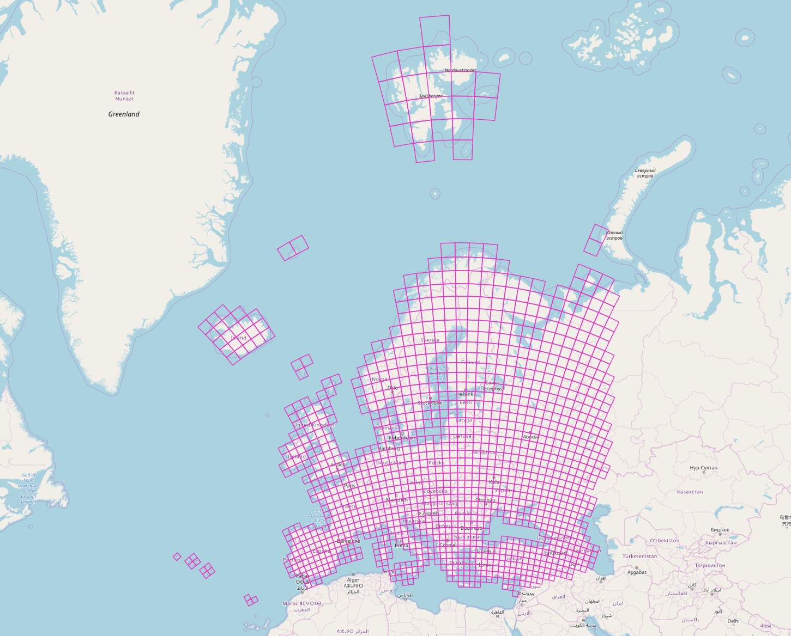

# EU-SoilHydroGrids_tiles_nav

The [The multilayered European Soil Hydraulic Database (EU-SoilHydroGrids ver1.0)](https://esdac.jrc.ec.europa.eu/content/3d-soil-hydraulic-database-europe-1-km-and-250-m-resolution) downloadable from the EU Joint Research Centre
European Soil Data Centre (ESDAC) is a fantastic resource. It is a high resolution collection of tiled Geotiff files of various hydraulic soil parameters ( [Tóth et al., 2015](https://doi.org/10.1002/hyp.11203)), gridded over all of Europe. However, we found it difficult to find the right tiles for our catchment area.



So, we created a polygon layer (available as SHP and GPKG) in 3 main useful projections for a more easy navigation, in order to support quick identification of your desired EU-SoilHydroGrids 250m GeoTiff tile folders.

For that we used Python and the `rasterio` library to read out the extents and coordinate reference system of the rasters:

```python
import numpy as np
import os

import rasterio
from rasterio.plot import show
from rasterstats import zonal_stats
from rasterio.warp import calculate_default_transform, reproject, Resampling

# the extracted zip from the download
path = r"E:\GEODATA\soil\eu_soil_hydrogrids\EU_SoilHydroGrids_250m_2017Feb08"

grid_cells = {}

folders = []
# r=root, d=directories, f = files
for r, d, f in os.walk(path):
    for folder in d:
        folders.append(folder)

        for r1, d1, f1 in os.walk(os.path.join(path, folder)):

            for file in f1:
                # we only took the first file per folder assuming they share the same extent and coordinate reference system
                if f"FC_M_sl1_{folder}.tif" in file:
                    files.append(os.path.join(r1, file))
                    data_src = rasterio.open(os.path.join(r1, file))
                    srs = data_src.crs
                    bounds = data_src.bounds
                    sub_obj = {
                        'grid_id': folder,
                        'srs': srs,
                        'bounds': bounds
                    }
                    grid_cells.update({ folder: sub_obj})
```

And then we wrote the grid cells out into a GDAL/OGR data source with the `fiona` library:

```python
import fiona
from shapely.geometry import box, Polygon, shape, mapping
from collections import OrderedDict

schema = {
    "geometry": "Polygon",
    "properties": OrderedDict([
        ("grid_id", "str:200"),
    ])
}

def make_poly_from_bounds(bounds):
    # (minx, miny, maxx, maxy) or a Polygon instance
    bbox = box(bounds.left, bounds.bottom, bounds.right, bounds.top)
    return bbox

def make_feature_from_dict(grid_obj):
    return {
        "geometry": mapping(make_poly_from_bounds(grid_obj.get('bounds'))),
        "properties": {"grid_id": grid_obj.get('grid_id')}
    }

features = []

# we could also do this in a for comprehension
for obj in grid_cells.values():
    feat = make_feature_from_dict(obj)
    features.append(feat)

crs_wkt = data_src.crs.wkt

with fiona.open(r"E:\GEODATA\soil\eu_soil_hydrogrids\EU_SoilHydroGrids_250m_2017Feb08\grid_cells_250m_aeqd84.shp", "w", driver="ESRI Shapefile", schema=schema, crs_wkt=crs_wkt) as collection:
    collection.writerecords(features)
    print(len(collection))
    collection.flush()
```

And then reprojected and saved the polygon layers in the original European-centred aeqd/wgs84, EPSG:4326  WGS84 and European projected ETRS89 in SHP and GPG with GDAL/OGR.

```bash
    # reproject example from original European-centred aeqd/wgs84 to EPSG:4326 WGS84
    ogr2ogr -f grid_cells_250m_wgs84.shp -t_srs EPSG:4326 grid_cells_250m_aeqd84.shp
    # convert from SHP to GPKG
    ogr2ogr -f GPKG grid_cells_250m_wgs84.gpkg grid_cells_250m_wgs84.shp
    ...
```

This data was derived from the European Soil Hydraulic Database (EU-SoilHydroGrids ver1.0) which are distributed under the [ODbL 1.0](https://www.opendatacommons.org/licenses/odbl/1.0/) license. This data repository is therefore also shared under the ODBl license:

*You are free:*

- To Share: To copy, distribute and use the database.
- To Create: To produce works from the database.
- To Adapt: To modify, transform and build upon the database.

*As long as you:*

- Attribute: You must attribute any public use of the database, or works produced from the database, in the manner specified in the ODbl. For any use or redistribution of the database, or works produced from it, you must make clear to others the license of the database and keep intact any notices on the original database.
- Share-Alike: If you publicly use any adapted version of this database, or works produced from an adapted database, you must also offer that adapted database under the ODbL.
- Keep open: If you redistribute the database, or an adapted version of it, then you may use technological measures that restrict the work (such as DRM) as long as you also redistribute a version without such measures.
